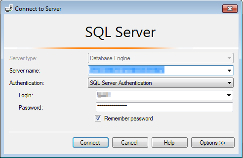
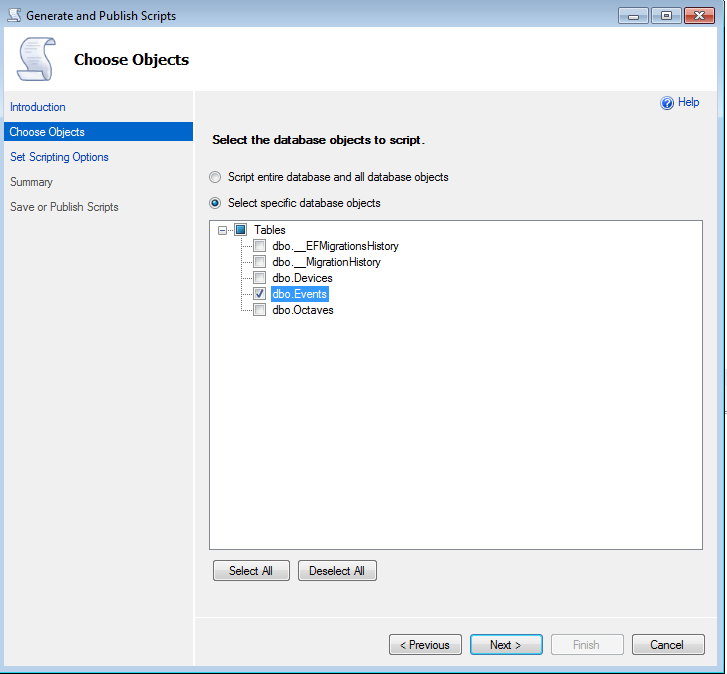
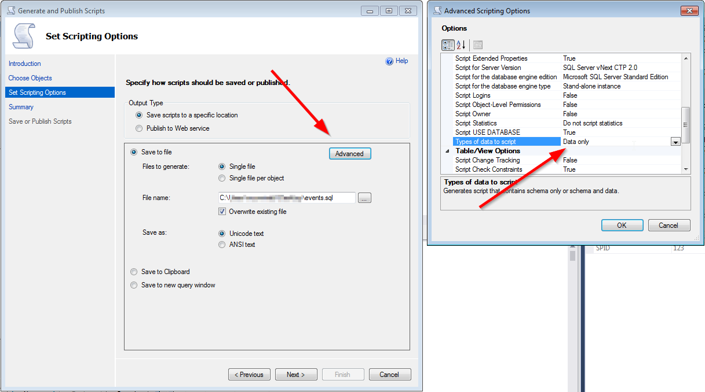
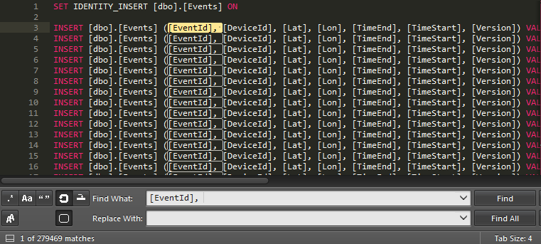
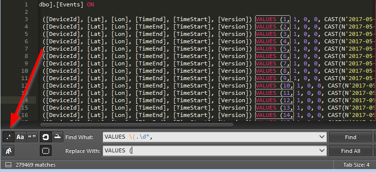
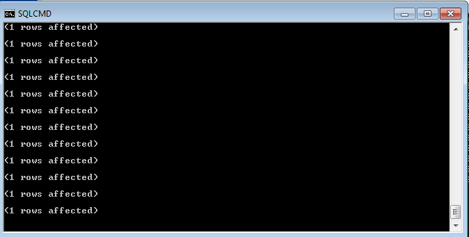

In this post I'll describe how to migrate large data sets from an Azure SQL database to another. It's a manual process, probably best suited for one-offs as it could take several hours depending on your server configuration and table size. 
I'm no data scientist, most of this knowledge was gathered from stackoverflow, so please handle with care.

To communicate with Azure use [Microsoft SQL Server Management Studio (SSMS)](https://docs.microsoft.com/en-us/sql/ssms/download-sql-server-management-studio-ssms).

1. Connect to the db and enter your Azure Database credentials
   

2. Right click on the database > "Generate scripts..."

3. Then "Select specific database objects" (here I'm just selecting a table each time to have more control over the process, but it should work also with more tables )
   

4. Next, click on "Advanced" and set "Types of data to script" to "Data only" (in this step, if the table is not very large, you could also just output it to a new query window and run the query to import it)
   

5. Finish the wizard and open the exported sql script

6. Remove the first two lines (the `USE` and `GO` statements weren't needed in my case) and rename the table the the new db's table name

7. Unless the data structure matches the new table just fine you might need to tweak the data a bit more. In my case I wanted to remove the auto-incremented ` EventId` to avoid conflicts with existing rows, I used SublimeText to remove that column: 

   - first replace `[EventId],` with an empty string

   - then replace the regex `VALUES \(.\d*, ` with `VALUES (`

   - if you remove this column, then also turn off `IDENTITY_INSERT` by removing the first and last lines `SET IDENTITY_INSERT [dbo].[Events] ON ` and `SET IDENTITY_INSERT [dbo].[Events] OFF` otherwise you'll receive an error message

     

     

8. Open cmd and run the command below to import the table into the new db, replace the required <> fields with the new db connection info: `SQLCMD -S <SERVER-NAME> -d <DB-NAME> -U <USERNAME> -P "<PASSWORD>" -i <PATH-TO-YOUR-SQL-FILE>.sql`

9. If everything goes well you'll see the message below until it's  complete
   

